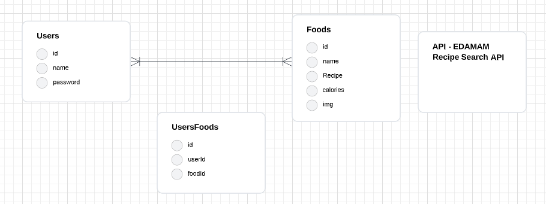

# Recipe Finder

## App Description
This application allows the user to sign up / login to a website that provides any desired recipe and it is all taken from an API. The user can search for the wanted recipe, save the recipe to a "To Cook" list that is unique to that specific user and also view the ingredients and calories in that recipe. If required the user can easily remove unwanted recipes from the "To cook: list.

## Approach Taken
* The project started with brainstorming for an idea which was a recipe website.
* A recipe API was found to get all the data from.
* Database with models for users, foods and usersFoods join were created.
* RESTful routes & CRUD were used to add functionality to the application and connect to the database.

## Explanations of the Technologies Used
* The terminal was used to create the models with the required column attributes.
* RESTful routes were used to route between the pages.
* CRUD functionality was given to the application to add a recipe from the API to the database using sequelize & assigning the recipe to the specific user.
* CRUD functionality to delete a recipe from the database when the user wants to remove the recipe from the "To cook" list.

## ERD

## RESTful Routing Table
Route | HTTP Verb | URL Pattern |
--- | --- | --- |
Login | GET | /users/login |
Sign up | GET | /users/new |
Home | GET | /foods |
Search results | GET | /foods/search?q=foodname |
Recipe Description | GET | /foods/search?q=foodname |
Saved Recipes | GET/POST | /foods/recipes |
Delete Recipe | DELETE | /foods/recipes/foodname |

## Post-Project Reflection
Following improvements shall be added to the project in the future:
* Allow the user to input the required number of calories per day.
* Prevent the user from adding recipes that exceed their daily calorie limit.

## Sources Used
1. Linking CSS file: https://stackoverflow.com/questions/24582338/how-can-i-include-css-files-using-node-express-and-ejs
2. Placement of images in search result: https://www.youtube.com/watch?v=BP1S_gaotCk
3. Placement of text on images: https://www.w3schools.com/howto/howto_css_image_text.asp
4. Background image: https://webdesigndev.com/free-dark-backgrounds/